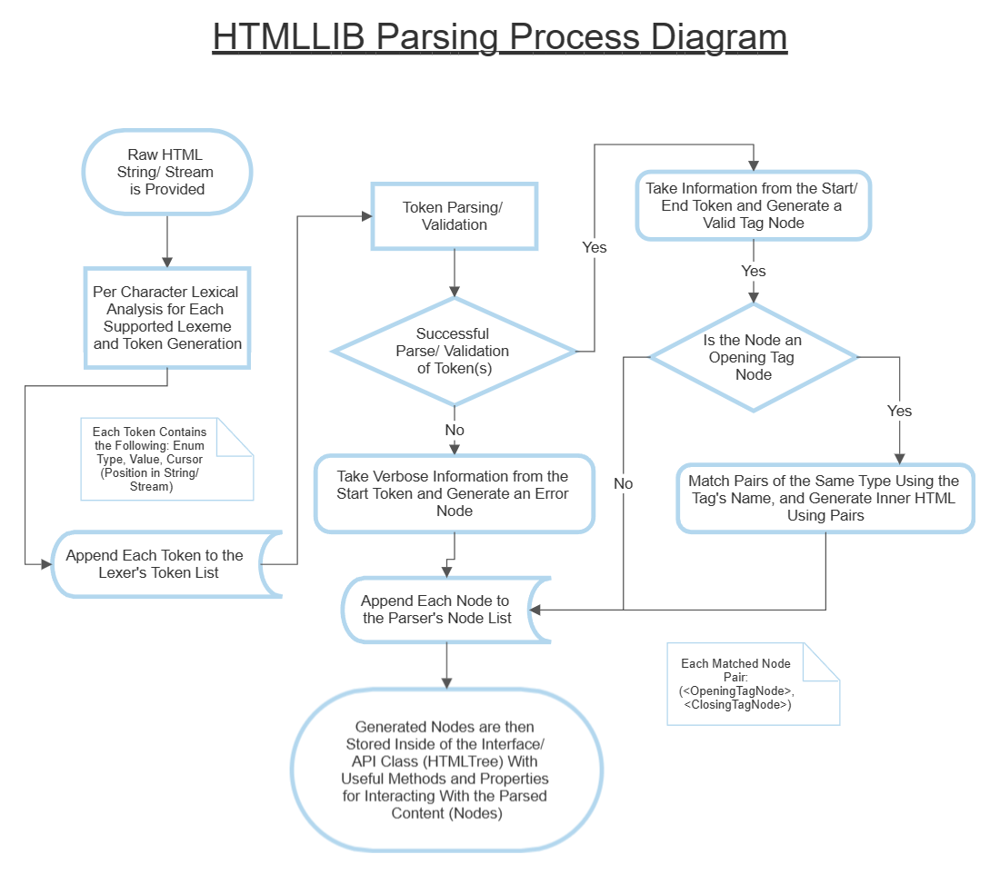

=======
HTMLLIB
=======

A Python3 Module that provides an API for gathering data from a stream/ string of HTML code.

There are no docs for this project yet as it is still in its early stages of development, although I have got some
cool things implemented, they will be in the ``main.py`` file either commented or uncommented. The ``main.py`` file is
the entry point for manual testing of the HTMLLIB module.

More information on how to use the module and examples to go along with it will be added soon, they are just not
priority as of this moment.

---------------------------
Parser Process Flow Diagram
---------------------------

------------------
Testing the Module
------------------

This project has decent test coverage thus far using the `unittest <https://docs.python.org/3/library/unittest.html>`_
module from Python3's standard library.

Run all tests with:

    .. code-block:: bash

        python -m unittest discover tests/

Run a single test with:

    .. code-block:: bash

        python -m unittest tests/test_<which>.py
